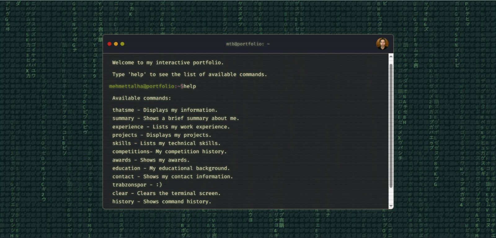

# Interactive Terminal Portfolio

A personal portfolio that best reflects a software engineering student in their own words.
Nice to meet you :)

## Features

-   **Interactive Terminal:** Navigate through my portfolio using shell-like commands (`help`, `projects`, `skills`, etc.).
-   **Retro Aesthetic:** Gruvbox color theme, CRT scanline effect, and a Matrix-style animated background for a nostalgic feel.
-   **Command History:** Use the up and down arrow keys to cycle through your command history.
-   **Pure JavaScript:** No heavy frameworks, just clean and simple code.

## Live Demo

You can view the live version of the portfolio here:
[https://talhabektas.github.io/portfolio/](https://talhabektas.github.io/portfolio/)

## How To Use

Simply open the website and start typing. Use the `help` command to see a list of all available commands.

---
Built by Mehmet Talha BEKTAŞ. 